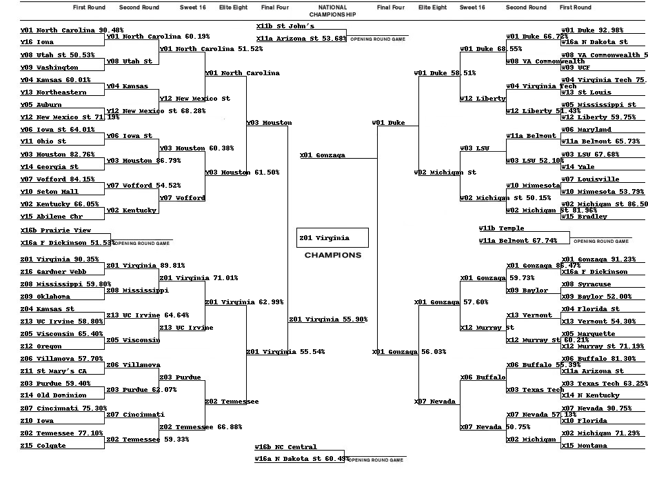

# March Madness 2019
A Machine Learning project to predict the results of the 2019 NCAA Men's March Madness Basketball tournament. The repository acts as a solution to Google Cloud and NCAA's Kaggle Competition on March Madness (https://www.kaggle.com/c/mens-machine-learning-competition-2019).

The output of this project is a list of predictions for which team will win a specified matchup. Each matchup is specified in the 'SampleSubmissionStage2.csv' file, with the IDs of the two teams listed. The project predicts the probability that the first team specified will beat the second team specified.

### Execution Instructions
To execute the project, complete the following steps:
1. Create dataset that holds details for each team for every season.
~~~~
python createTeamDetails.py
~~~~~~~~ 

2. Create dataset that contains details about every past matchup, which is used as the training dataset.
~~~~
python createTrainingDataset.py
~~~~~~~~ 

3. Create predictive models that can be used to predict the outcomes of future fixtures.
~~~~
python createPredictionModel.py
~~~~~~~~ 

4. Create dataset that holds the data used by the model for matchups that must be predicted in the submission.
~~~~
python createPredictionsDataset.py
~~~~~~~~ 

5. Use the most accurate model created to create predictions, and write these to the submissions file.
~~~~
python createPredictions.py
~~~~~~~~ 

6. Create a visual representation of the predictions made.
~~~~
python createBracket.py
~~~~~~~~ 

7. Submit the predictions to the Kaggle competition (requires setting up of the Kaggle library and Kaggle API).
~~~~
kaggle competitions submit -c mens-machine-learning-competition-2019 -f submission.csv -m "My submission."
~~~~~~~~ 

### File Details
Other files included or created in this repository include:
* *data/RegularSeasonDetailedResults.csv*: Holds data from NCAA Regular Season matchups since 1985.
* *data/NCAATourneyDetailedResults.csv*: Holds data from NCAA March Madness matchups since 2003.
* *data/TeamConferences.csv*: Holds data regarding the team ID's of each team part of the dataset for each year.
* *data/all_teamData.csv*: Holds per-season data for each NCAA team since 2003.
* *data/2019_teamData.csv*: Holds regular season data for 2019 NCAA teams.
* *data/all_dataset.csv*: Holds data for all NCAA matchups since 2003 in a format suitable for use as training data.
* *scaler.save*: Holds the scaler that is used to preprocess data before it is used for predictions.
* *predictor.pkl*: Holds the most accurate classifier created during the training phase.
* *data/stage1_dataset.csv*: Holds data for matchups identified in Stage 1 in a format suitable for making predictions with.
* *data/stage2_dataset.csv*: Holds data for matchups identified in Stage 2 in a format suitable for making predictions with.
* *SampleSubmissionStage1.csv*: Holds details regarding which matchups should be predicted for Stage 1.
* *SampleSubmissionStage2.csv*: Holds details regarding which matchups should be predicted for Stage 2.
* *SubmissionStage1.csv*: Holds the submissions for Stage 1 of the Kaggle competition, as it stores the matchup predictions.
* *SubmissionStage2.csv*: Holds the submissions for Stage 2 of the Kaggle competition, as it stores the matchup predictions.
* *data/Teams.csv*: Holds data regarding the team name of each team based on their team ID. 
* *data/NCAATourneySeeds.csv*: Holds data regarding the NCAA seed of each team.
* *data/NCAATourneySlots.csv*: Holds data regarding the NCAA slot of each team.
* *bracket.png*: Holds a visual representation of the predictions made in the form of a bracket for the 2019 tournament.

### Predictor Details
The features in an input instance for this model are:	
* 0: Team 1 Home or Away (1: Home, 0: Neutral, -1: Away)
* 1: Team 1 Points per game - Team 2 Points per game
* 2: Team 1 Points Allowed per game - Team 2 Points Allowed per game
* 3: Team 1 Field Goals Made per game - Team 2 Field Goals Made per game
* 4: Team 1 Field Goals Attempted per game - Team 2 Field Goals Attempted per game
* 5: Team 1 3-Pointers Made per game - Team 2 3-Pointers Attempted per game
* 6: Team 1 Free-Throws Made per game - Team 2 Free-Throws Attempted per game
* 7: Team 1 Offensive Rebounds per game - Team 2 Offensive Rebounds per game
* 8: Team 1 Defensive Rebounds per game - Team 2 Defensive Rebounds per game
* 9: Team 1 Assists per game - Team 2 Assists per game
* 10: Team 1 Turnovers per game - Team 2 Turnovers per game
* 11: Team 1 Steals per game - Team 2 Steals per game
* 12: Team 1 Blocks per game - Team 2 Blocks per game
* 13: Team 1 Personal Fouls per game - Team 2 Personal Fouls per game

The output for an input instance for this model is the probability that Team 1 wins.

### NCAA 2019 Tournament Predictions

